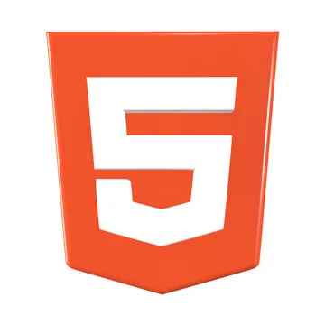
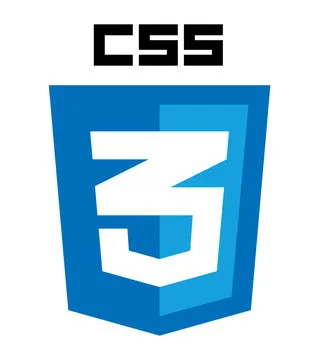
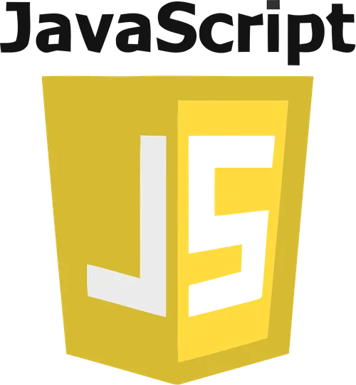

## Dự án tốt nghiệp: Website bán mô hình GundamWin

#### 1.Mô tả:

<p>
Phát triển một website bán mô hình giúp khai thác tiềm năng từ thị trường này, đáp ứng nhu cầu mua sắm trực tuyến ngày càng cao.
<br/>
Khách hàng đam mê sưu tầm mô hình thường có nhu cầu tìm kiếm những sản phẩm độc đáo, chính hãng, và tiện lợi trong việc đặt hàng. 
</p>

<span>
Link website:
</span>

**<a href='https://gundamwin.store'>Tại đây</a>**

#### 2.Thành viên nhóm , phân công việc :

| **Thành viên**           | **Công việc**                                                                                                                                                                                           |
| ------------------------ | ------------------------------------------------------------------------------------------------------------------------------------------------------------------------------------------------------- |
| **Nguyễn Văn Nghiệp**    | Phân tích đề tài, Xây dựng cơ sở dữ liệu, Vẽ sơ đồ usecase, Thực hiện làm docs, Thực hiện code: Quản lý người dùng, quản lý sản phẩm, mã giảm giá, quản lý...                                           |
| **Đặng Văn Thịnh**       | Phân tích đề tài, Xây dựng cơ sở dữ liệu, Kiểm tra code trước khi hợp nhất với nhánh chính, Triển khai hệ thống, Thực hiện code: Cắt giao diện từ mẫu có sẵn , giỏ hàng, thanh toán, chat...            |
| **Nguyễn Thị Thu Trang** | Phân tích đề tài, Xây dựng cơ sở dữ liệu, Khảo sát, Thực hiện làm docs, Thực hiện code: Quản lý banner, chính sách...                                                                                   |
| **Nguyễn Văn Quân**      | Phân tích đề tài, Xây dựng cơ sở dữ liệu, Thực hiện code: Quản lý mã giảm giá, tìm kiếm sản phẩm, chi tiết sản phẩm...                                                                                  |
| **Ngô Thành Đạt**        | Phân tích đề tài, Xây dựng cơ sở dữ liệu, Thực hiện code: Đăng ký, đăng nhập, quên mật khẩu, lịch sử đơn hàng, phân quyền...                                                                            |
| **Nguyễn Bá Kỳ**         | Phân tích đề tài, Xây dựng cơ sở dữ liệu, Vẽ sơ đồ usecase, Vẽ sơ đồ luồng hoạt động, Thực hiện code: Quản lý thuộc tính, hiển thị bài viết, tìm kiếm bài viết, bình luận bài viết, sắp xếp sản phẩm... |
| **Nguyễn Hoa Kỳ**        | Phân tích đề tài, Xây dựng cơ sở dữ liệu, Thực hiện code: Quản lý bài viết, lọc sản phẩm, hiển thị sản phẩm ở trang chủ...                                                                              |

#### 3.Công nghệ sử dụng:

<div>







</div>
<strong>
<ul>
<li>PHP : 8.1</li>
<li>Laravel : 10.10 </li>
<li>Mysql</li>
<li>HTML , CSS , JAVASCRIPT</li>
<li>Bootstrap 5</li>
</ul>

</strong>

#### 4.Chức năng

-   [x] **Admin:**
<ul>
    <li> Quản lý danh mục sản phẩm  </li>
    <li> Quản lý thuộc tính </li>
    <li> Quản lý bài viết </li>
    <li> Quản lý danh mục bài viết </li>
    <li> Quản lý phiếu giảm giá</li>
    <li> Quản lý phản hồi </li>
    <li> Quản lý người dùng</li>
    <li> Quản lý đơn hàng </li>
    <li> Quản lý đơn hoàn</li>
    <li> Quản lý banner</li>
    <li> Thống kê</li>

</ul>

-   [x] **Người dùng:**

<ul>
<li>Đăng kí, đăng nhập</li>
<li>Quên mật khẩu</li>
<li>Xem trang chủ</li>
<li>Xem chi tiết sản phẩm</li>
<li>Giỏ hàng</li>
<li>Mua hàng</li>
<li>Xem lịch sử mua hàng</li>
<li>Liên hệ </li>
<li>Sản phẩm yêu thích</li>
<li>Chính sách website</li>
<li>Đánh giá sản phẩm</li>
<li>Xem bài viết</li>
<li>Bình luận bài viết</li>
<li>Quên mật khẩu</li>
<li>Chat realtime</li>
<li>Sản phẩm yêu thích</li>
<li>Thanh toán Online (MOMO)</li>

</ul>

<!-- video demo dự án nếu có -->

<!-- <iframe width="560" height="315" src="https://www.youtube.com/embed/t4oq9SDaJmE" frameborder="0" allowfullscreen></iframe> -->

#### 5.Hướng dẫn cấu hình và chạy dự án

<ol>
<li>
<p>Clone dự án</p>
<p>

`https://github.com/dang-van-thinh/ecommerce-gundam-win.git`

</p>
</li>
<li>
<p>Cấu hình</p>

<p>

```
# truy cập vào thư mục dự án
cd ecommerce-gundam-win
# sao chép file cấu hình mẫu
cp .env.example .env 
# cập nhật các gói package
composer update
# Tạo một khóa bảo mật cho ứng dụng
php artisan key:generate
# cập nhật các gói package frontend
npm i
```

</p>
</li>

<li>
<p>Cài bổ sung</p>
<p>

```
# tạo các bảng database
php artisan migrate

# tạo tài khoản admin và quyền (Admin , Client ,Staff)
php artisan db:seed --class=RolePermissionSeeder

# thêm
# import dữ liệu tỉnh thành việt nam
thư mục dự án  > database > dia-chi.sql

#tiến hành chạy

# khởi chạy dự án

php artisan serve
npm run dev
```

</p>
</li>
</ol>
